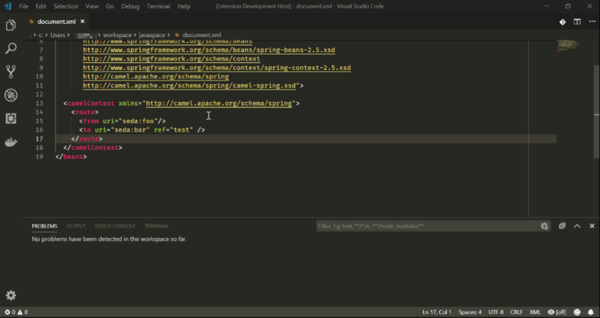

# XML Language Server

> I started this project when there was no XML Plugin available for VSCode. But now we have XML Plugin by RedHat available, 
> so I recommend all to use that.  
> Do check em out: https://github.com/angelozerr/lsp4xml, https://github.com/redhat-developer/vscode-xml.  
> I will continue improving the current one, but not having the freedom to dedicate time on it
> may take a bit longer to finish it.

 [](https://coveralls.io/github/HandOfGod94/xml-language-server?branch=dev)

Language server for XML documents. It enables and LSP client (VScode, Sublime LSP, Eclipse Che) to leverage 
capabilities such as autocomplete, validation or documentation support for XML documents.

> Refer to [CONTRIBUTING.md](./CONTRIBUTING.md##setup-dev-environment) for setting up
> development environment

## Demo



## Features
* XML Validations
  - [x] XSD
  - [ ] DTD
* Autocomplete
  - [x] XSD
  - [ ] DTD
* Documentation
  - [x] XSD
  - [ ] DTD

## What is language server?

Language server is the server part of Language Server Protocol (LSP).  
As per official documentation,
> The Language Server protocol is used between a tool (the client) and a language smartness provider (the server) 
> to integrate features like auto complete, go to definition, find all references and alike into the tool.

## Why XML?
We use XML documents, configs extensively for our day to day work, and simple config typo of elements or attributes
breaks our head for hours. `Intellij` was already supporting features for XML such as **validation, autocomplete,
documentation (using annotations from xsd)**, but text editors like `vscode` or `sublime` doesn't have support for XML.
It's an attempt to make editors smart for XML documents.

## Why Java?
Currently the implementation of language server for XML is done in Java. I couldn\'t find a mature and apt
library for XML manipulations in other languages. Becuase of the nature of Java previous to `Java 9` the users
of this server (language client) needs to have `java` installed in their system.

## Build

* Requirements:
  - Java 8
  - Maven 3.5+

```shell
mvn clean package # To generate jar file locally
mvn clean install # To install artifact in local repository
```

### For Docker Fans

```shell
docker run -it --rm --name xml-language-server -v $(pwd):/usr/src/mymaven -w /usr/src/mymaven maven:3.6.0-jdk-8-alpine mvn clean install
```

Don't forget to replace `$(pwd)` with absolute path of the project.  
Also if you are on windows make sure, you have give docker permission to access/mount volumes.
